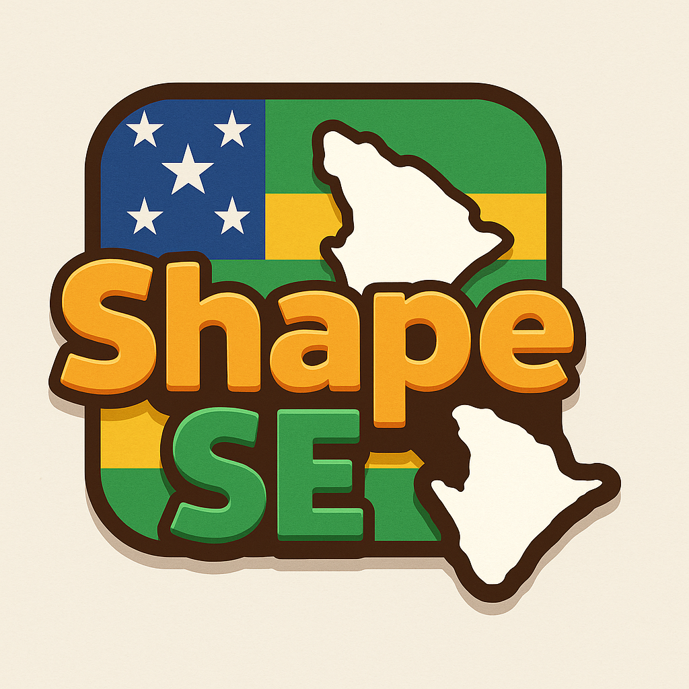
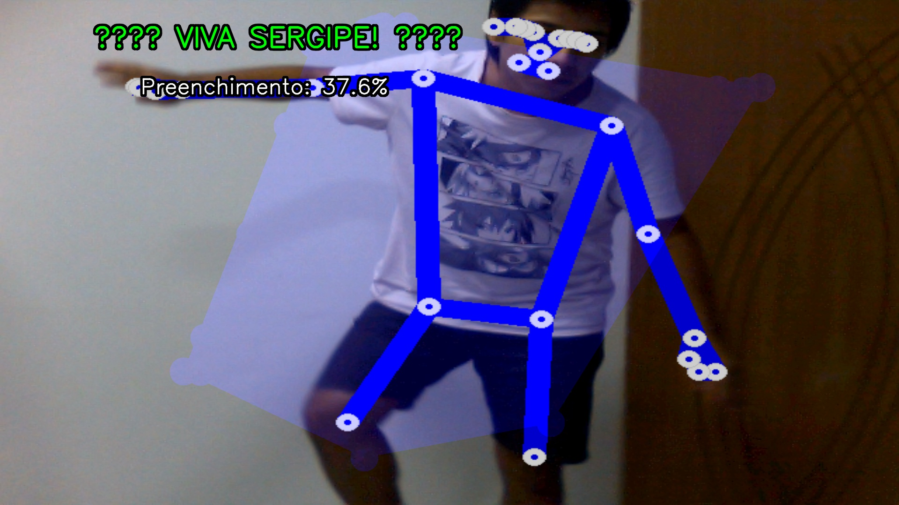

# <p align="center">🎮 VIVA SERGIPE! 🎮</p>
# <p align="center">v1.2.0 FINAL</p>

<p align="center">
  
  <br>
  <em>Jogo Interativo de Detecção Corporal com MediaPipe</em>
</p>

<p align="center">
  
  
  
  
</p>

<p align="center">
  <b>🏆 PROJETO FINALIZADO COM SUCESSO TOTAL! 🏆</b>
</p>

---

<details open>
<summary><h2>📖 Sobre o VIVA SERGIPE!</h2></summary>

**VIVA SERGIPE!** é um jogo inovador onde você usa seu corpo para preencher o contorno do mapa do estado de Sergipe!

<p align="center">
  
</p>

### ✨ Características Principais

| 🎮 **Gameplay** | 🛠️ **Tecnologia** | 🎯 **Experiência** |
|------------|--------------|---------------|
| Detecção corporal em tempo real | MediaPipe avançado | Interface moderna PyQt5 |
| 6 modos de jogo diferentes | OpenCV para processamento | Tela cheia otimizada |
| 19 conquistas desbloqueáveis | Sistema de filas robusto | Configurações personalizáveis |
| Contorno interativo do mapa | Persistência de dados | Feedback visual avançado |
| Captura automática de vitória | Otimização adaptativa | Sistema de áudio completo |

</details>

---

<details open>
<summary><h2>🏆 STATUS FINAL - PROJETO COMPLETO</h2></summary>

<p align="center">
  <b>✅ VERSÃO 1.2 FINALIZADA COM SUCESSO TOTAL! ✅</b>
</p>

### 🎯 Funcionalidades Implementadas (98%)

<table>
  <tr>
    <td width="50%" valign="top">
      <ul>
        <li>✅ <b>6 Modos de Jogo</b>: Clássico, Relaxado, Speedrun, Precisão, Desafio, Treinamento</li>
        <li>✅ <b>19 Conquistas</b>: Sistema completo de achievements motivacionais</li>
        <li>✅ <b>Otimização Adaptativa</b>: Performance otimizada para qualquer hardware</li>
        <li>✅ <b>Interface Profissional</b>: Menu PyQt5 completo com configurações avançadas</li>
        <li>✅ <b>Sistema de Configurações</b>: Persistente com 17 opções personalizáveis</li>
      </ul>
    </td>
    <td width="50%" valign="top">
      <ul>
        <li>✅ <b>Feedback Visual Avançado</b>: Análise de qualidade em tempo real</li>
        <li>✅ <b>Sistema de Sincronização</b>: Robusto e sem processos órfãos</li>
        <li>✅ <b>Analytics Opcional</b>: Telemetria respeitando privacidade</li>
        <li>✅ <b>Sistema de Atualizações</b>: Automático e seguro</li>
        <li>✅ <b>Instalador Completo</b>: Distribuição profissional</li>
      </ul>
    </td>
  </tr>
</table>

### 📊 Métricas de Qualidade

<p align="center">
  
  
  
  
  
</p>

### 🎮 Experiência do Usuário

<p align="center">
  <table align="center">
    <tr>
      <td align="center"><br>Instalação automática</td>
      <td align="center"><br>6 modos únicos</td>
      <td align="center"><br>19 conquistas</td>
    </tr>
    <tr>
      <td align="center"><br>Performance adaptativa</td>
      <td align="center"><br>Interface moderna</td>
      <td align="center"><br>Mapa interativo</td>
    </tr>
  </table>
</p>

<p align="center">
  <b>🎉 O jogo está PRONTO PARA DISTRIBUIÇÃO e uso pela comunidade sergipana! 🇧🇷</b>
</p>

</details>

---

<details>
<summary><h2>🚀 Instalação</h2></summary>

Para começar a usar o jogo, siga estes passos:

### 1️⃣ Clone o repositório

```bash
git clone https://github.com/dougdotcon/VIVA_SERGIPE.git
cd VIVA_SERGIPE
```

### 2️⃣ Configure o ambiente (opcional)

<table>
  <tr>
    <th>Windows</th>
    <th>macOS/Linux</th>
  </tr>
  <tr>
    <td>
      <pre>python -m venv envname
envname\Scripts\activate</pre>
    </td>
    <td>
      <pre>python3 -m venv envname
source envname/bin/activate</pre>
    </td>
  </tr>
</table>

### 3️⃣ Instale as dependências

```bash
pip install -r requirements.txt
```

### 4️⃣ Inicie o jogo

```bash
python sergipe_game.py
```

</details>

---

<details>
<summary><h2>🎮 Como Jogar</h2></summary>

<table>
  <tr>
    <td width="50%" valign="top">
      <h3>🔄 Fluxo do Jogo</h3>
      <ol>
        <li><b>Menu PyQt</b>: Clique em "🎮 JOGAR" para iniciar</li>
        <li><b>Início Automático</b>: O jogo OpenCV abre em tela cheia</li>
        <li><b>Interface Limpa</b>: Sem menus no OpenCV, apenas o jogo</li>
        <li><b>Controles Simples</b>: Q/ESC para sair, F11 para tela cheia</li>
      </ol>
    </td>
    <td width="50%" valign="top">
      <h3>🎯 Objetivo</h3>
      <ul>
        <li>Use seu corpo para preencher o contorno verde do mapa de Sergipe</li>
        <li>Alcance <b>30% de preenchimento</b> em <b>5 minutos</b></li>
        <li>Seja criativo com suas poses - use braços, pernas e todo o corpo!</li>
        <li>Fotos de vitória são salvas automaticamente em <code>snapshots/</code></li>
      </ul>
    </td>
  </tr>
  <tr>
    <td colspan="2" align="center">
      <h3>🎮 Modos de Jogo</h3>
      <table>
        <tr>
          <td align="center">🏆 <b>Clássico</b><br>Experiência padrão</td>
          <td align="center">🧘 <b>Relaxado</b><br>Sem pressão de tempo</td>
          <td align="center">⚡ <b>Speedrun</b><br>Desafio de velocidade</td>
        </tr>
        <tr>
          <td align="center">🎯 <b>Precisão</b><br>Meta alta para experts</td>
          <td align="center">🏅 <b>Desafio</b><br>Objetivos especiais</td>
          <td align="center">🎓 <b>Treinamento</b><br>Com feedback educativo</td>
        </tr>
      </table>
    </td>
  </tr>
</table>

</details>

---

<details>
<summary><h2>📁 Estrutura do Projeto</h2></summary>

```
VIVA_SERGIPE/
├── 🗺️ sergipe_game.py          # Arquivo principal (ponto de entrada)
├── 🎮 game_controller.py       # Controlador do sistema dual
├── 🎯 sergipe_game_headless.py # Jogo OpenCV controlável
├── 🖼️ menu_gui.py              # Interface PyQt elegante
├── 🛠️ sergipe_utils.py         # Utilitários específicos do jogo
├── 🔧 utils.py                 # Utilitários compartilhados
├── 🧪 test_sergipe.py          # Testes do jogo
├── 👁️ test_visual.py           # Teste visual do contorno
│
├── 📦 assets/                  # Recursos do jogo
│   ├── 🗺️ contorno-mapa-SE.png # Contorno do mapa de Sergipe
│   ├── 🏴 flag-se.jpg          # Bandeira de Sergipe (background)
│   └── 🖼️ background*.webp     # Imagens de fundo
│
├── 🎵 sounds/                  # Arquivos de áudio
│   ├── 🎶 background.mp3       # Música de fundo
│   ├── ✅ confirmation.mp3     # Som de confirmação
│   ├── ⏰ countdown.mp3        # Som de contagem
│   └── 🏆 game_over*.mp3       # Sons de fim de jogo
│
├── 📸 snapshots/               # Fotos de vitória (criado automaticamente)
└── 📋 requirements.txt         # Dependências
```

</details>

---

<details>
<summary><h2>🛠️ Personalização</h2></summary>

<table>
  <tr>
    <th>Categoria</th>
    <th>Opções</th>
    <th>Como Personalizar</th>
  </tr>
  <tr>
    <td>⚙️ Configurações</td>
    <td>Duração, Meta, Sensibilidade</td>
    <td>Menu PyQt → Configurações</td>
  </tr>
  <tr>
    <td>🎨 Visual</td>
    <td>Contorno, Interface</td>
    <td>Substitua arquivos em <code>assets/</code></td>
  </tr>
  <tr>
    <td>🎵 Áudio</td>
    <td>Música, Efeitos</td>
    <td>Substitua arquivos em <code>sounds/</code></td>
  </tr>
  <tr>
    <td>🧩 Avançado</td>
    <td>Parâmetros técnicos</td>
    <td>Edite <code>sergipe_game.py</code></td>
  </tr>
</table>

</details>

---

<details>
<summary><h2>🎵 Requisitos de Sistema</h2></summary>

<table>
  <tr>
    <td width="50%" valign="top">
      <h3>💻 Software</h3>
      <ul>
        <li>🐍 <b>Python 3.7+</b></li>
        <li>🖼️ <b>PyQt5</b> - Interface gráfica</li>
        <li>📹 <b>OpenCV</b> (cv2) - Processamento de vídeo</li>
        <li>👤 <b>MediaPipe</b> - Detecção corporal</li>
        <li>🧮 <b>NumPy</b> - Computação numérica</li>
        <li>🎵 <b>Pygame</b> - Sistema de áudio</li>
      </ul>
    </td>
    <td width="50%" valign="top">
      <h3>🖥️ Hardware</h3>
      <table>
        <tr>
          <th>Componente</th>
          <th>Mínimo</th>
          <th>Recomendado</th>
        </tr>
        <tr>
          <td>📹 Webcam</td>
          <td>Obrigatório</td>
          <td>HD 720p+</td>
        </tr>
        <tr>
          <td>💻 Processador</td>
          <td>Core i3</td>
          <td>Core i5+</td>
        </tr>
        <tr>
          <td>🧠 RAM</td>
          <td>4GB</td>
          <td>8GB+</td>
        </tr>
        <tr>
          <td>💾 Armazenamento</td>
          <td>500MB</td>
          <td>1GB+</td>
        </tr>
      </table>
    </td>
  </tr>
</table>

</details>

---

<details>
<summary><h2>🚀 Início Rápido</h2></summary>

<div align="center">

```bash
# Clone o repositório
git clone https://github.com/dougdotcon/VIVA_SERGIPE.git
cd VIVA_SERGIPE

# Instale dependências
pip install -r requirements.txt

# Execute o jogo
python sergipe_game.py
```

</div>

</details>

---

<details>
<summary><h2>🆕 Melhorias Recentes</h2></summary>

### 🎮 Destaques da Versão 1.2

<table>
  <tr>
    <td width="33%" align="center">
      <br>
      <b>Otimização Adaptativa</b><br>
      <small>Detecta hardware e ajusta automaticamente</small>
    </td>
    <td width="33%" align="center">
      <br>
      <b>6 Modos de Jogo</b><br>
      <small>Experiências únicas para todos os jogadores</small>
    </td>
    <td width="33%" align="center">
      <br>
      <b>Sistema de Conquistas</b><br>
      <small>19 achievements desbloqueáveis</small>
    </td>
  </tr>
</table>

### 🔄 Sistema Dual Coordenado
- **Menu PyQt Elegante**: Interface moderna com background da bandeira de Sergipe
- **Início Automático**: Sem necessidade de pressionar SPACE - clique e jogue!
- **Coordenação Perfeita**: Menu e jogo trabalham juntos sem conflitos
- **Experiência Fluida**: Transições suaves entre menu e jogo

### ♻️ Funcionalidades Removidas/Simplificadas
- ❌ **Contador Manual**: Removido - o jogo inicia automaticamente
- ❌ **Mensagens na Tela**: Interface mais limpa sem textos desnecessários
- ❌ **Menus OpenCV**: Apenas o jogo OpenCV, menu fica no PyQt
- ✅ **Controles Simplificados**: Apenas Q/ESC e F11

</details>

---

<details>
<summary><h2>🤝 Agradecimentos</h2></summary>

<p align="center">Agradecimentos especiais a:</p>

<div align="center">
  <table>
    <tr>
      <td align="center">
        <br>
        <b>Comunidade MediaPipe</b><br>
        <small>pela incrível biblioteca de detecção corporal</small>
      </td>
      <td align="center">
        <br>
        <b>Comunidade PyQt</b><br>
        <small>pela excelente framework de interface gráfica</small>
      </td>
      <td align="center">
        <br>
        <b>Estado de Sergipe</b><br>
        <small>pela inspiração geográfica do jogo</small>
      </td>
    </tr>
  </table>
</div>

</details>

---

<div align="center">
  
## 📄 Licença

Este projeto está sob licença MIT. Veja o arquivo LICENSE para mais detalhes.

## 🐛 Reportar Problemas

Encontrou um bug ou tem uma sugestão? Abra uma [issue](https://github.com/dougdotcon/VIVA_SERGIPE/issues) no GitHub!

</div>

---

<p align="center">
  <b>🎮 Divirta-se jogando VIVA SERGIPE! 🎮</b>
  <br>
  
</p>
